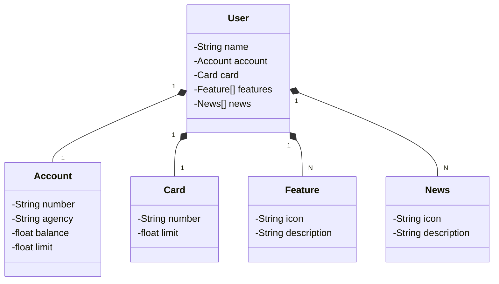

# Santander Dev Week 2024.
Projeto (Java RESTful API) criado no Bootcamp Santander 2024 para ser enviado (deploy) em uma plataforma de nuvem.

## Diagrama de classes

Esta API foi criada com o intuito de praticar o deploy da mesma em uma plataforma de nuvem (Render), fazendo o provisionamento do banco de dados (Postgres) também nesta plataforma, reforçando assim os conhecimentos do desenvolvimento de uma api e sobre o processo de Integraçao Contínua (CI) e Entrega Contínua (CD).
